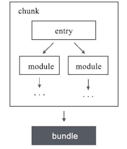
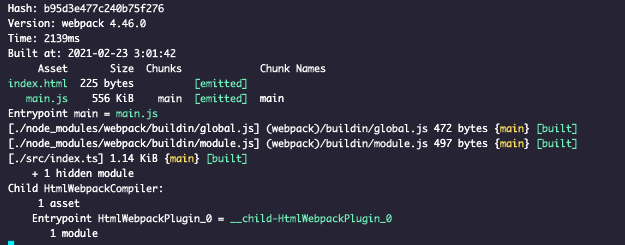

# 基础概念
## module & chunk & bundle
- module：模块，webpack 中每一个文件即为一个模块。
- chunk：代码块，以入口文件（一个模块）为起点，包含该文件所递归依赖的所有文件（若干模块）组成一个 `chunk`，简单理解`entry`中有几个入口文件，就有几个 `chunk`，且入口名称即为 `chunk` 名字。
- bundle：webpack 构建出的最终产物，一般与 `chunk` 相对应。

    
    
module、chunk、bundle 的关系图

## hash & chunkhash & contenthash
- hash：一次打包产生的 hash 值，20 位十六进制数。

    
    
构建生成的hash值

- chunkhash：chunk内容的 hash 值，chunk 中`任意模块`发生变化都会引发 `chunkhash` 值的变化。
- contenthash：模块内容的 hash 值，`文件内容`发生变化即引发 `contenthash` 值的变化。